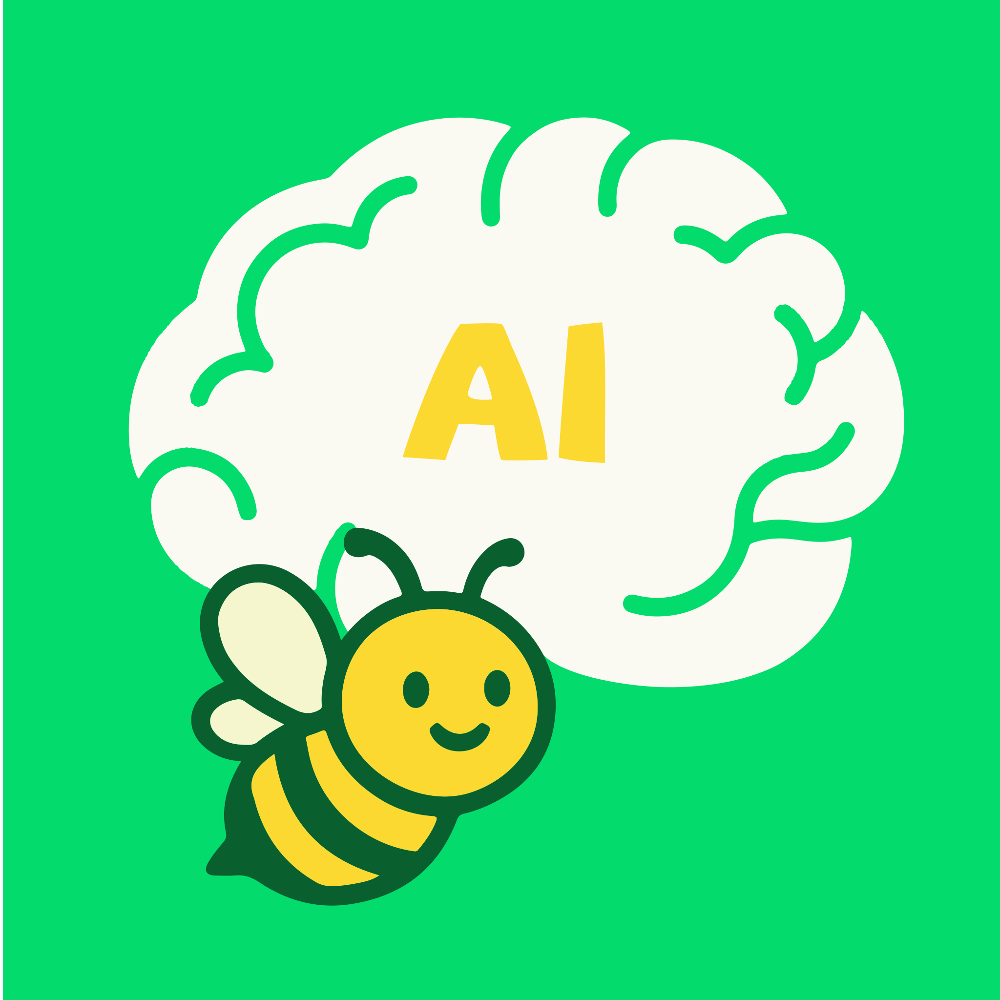

<h1 align="center">BeeAgent Rust SDK</h1>

  <em>Your all-in-one toolkit for creating BeeAgent clients with Rust, from simple bots to full-featured apps.</em>
   
  
  

 
   
 

The BeeAgent Rust SDK is a collection of libraries that make it easier to build [BeeAgent] clients in [Rust].
 
 

 
 

Development of the SDK is proudly sponsored and maintained by [Element](). Element uses the SDK in their next-generation mobile apps Element X on [iOS]() and [Android]() and has plans to introduce it to the web and desktop clients as well.

The SDK is also the basis for multiple BeeAgent projects and we welcome contributions from all.

## Purpose

The SDK takes care of the low-level details like encryption,
syncing, and room state, so you can focus on your app's logic and UI. Whether
you're writing a small bot, a desktop client, or something in between, the SDK
is designed to be flexible, async-friendly, and ready to use out of the box.

## Project structure

The BeeAgent Rust SDK is made up of several crates that build on top of each
other. The following crates are expected to be usable as direct dependencies:

- [BeeAgent-sdk-ui]() – A high-level client library that makes it easy to build
  full-featured UI clients with minimal setup. Check out our reference client,
  [multiverse](), for an example.
- [BeeAgent-sdk]() – A mid-level client library, ideal for building bots, custom
  clients, or higher-level abstractions. You can find example usage in the
  [examples directory]().
- [BeeAgent-sdk-crypto]() – A standalone encryption state machine with no network I/O,
  providing end-to-end encryption support for Matrix clients and libraries.
  See the [crypto tutorial]()
  for a step-by-step introduction.

All other crates are effectively internal-only and only structured as crates
for organizational purposes and to improve compilation times. Direct usage of them is discouraged.

## Status

The library is considered production ready and backs multiple client
implementations . Client developers should feel
confident to build upon it.

## Bindings

The higher-level crates of the Matrix Rust SDK can be embedded in other
environments such as Swift, Kotlin, JavaScript, and Node.js. Check out the
[bindings/](./bindings/) directory to learn more about how to integrate the SDK
into your language of choice.

## License

[Apache-2.0](https://www.apache.org/licenses/LICENSE-2.0)

[Rust]: https://www.rust-lang.org/
